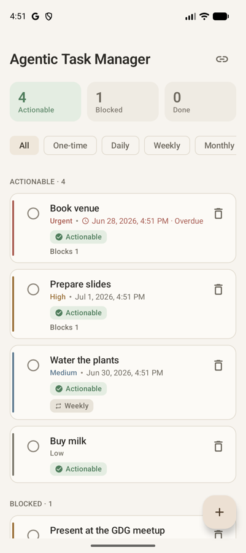
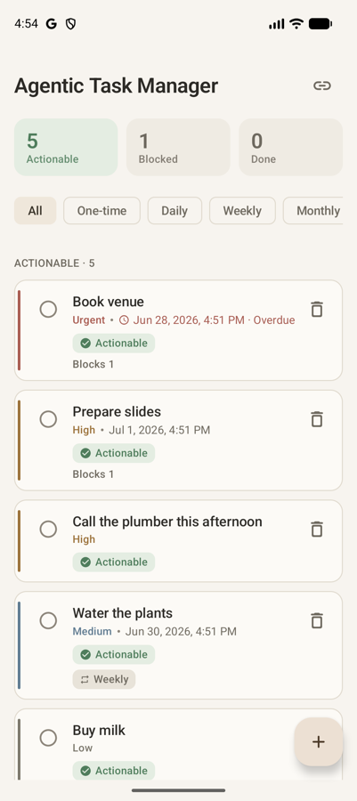

# Agentic Task Manager

An Android task manager whose operations are exposed as [AppFunctions](https://developer.android.com/ai/appfunctions), so an on-device agent can carry them out from natural language. Gemini is the reference agent, but the functions are written and measured to route reliably across function-calling models rather than a single one. The user interface is deliberately minimal; the subject of the project is the agent-facing layer and how reliably it can be driven.

## Overview

AppFunctions is the Jetpack layer that lets an app publish selected operations as tools an agent can call. It is roughly the Android counterpart of MCP. This project publishes five such operations over a domain with enough structure to be worth reasoning about: tasks form a dependency graph rather than a flat list.

The rule that holds the domain together is actionability. A task can depend on other tasks and becomes actionable only once every task it depends on is complete. Actionability is computed by walking the graph rather than stored, so completing one task immediately re-derives what its dependents can do next. Dependency edges must stay acyclic, and an edge that would close a cycle is rejected before it is saved.

## Architecture

Two Gradle modules with a strict boundary between them.

```
:domain   pure Kotlin/JVM, no Android
  model/        Task, TaskId, Priority, TaskStatus, Recurrence, DependencyEdge
  graph/        DependencyGraph (cycle detection), Actionability, TaskInsight
  usecase/      AddTask, AddDependency, CompleteTask, DeleteTask, queries, ObserveTaskBoard
  repository/   TaskRepository (interface)

:app      Android
  data/         Room entities, DAOs, mappers, repository implementation, seeder
  agent/        @AppFunction adapters and @AppFunctionSerializable DTOs
  ui/           Jetpack Compose
  di/           Hilt
```

`:domain` does not apply the Android Gradle plugin, so it cannot reference the Android framework even by accident; the boundary is enforced by the compiler rather than by convention. Dependencies point inward toward it: the UI depends on use cases, the data layer implements a domain interface, and Hilt is the only place that binds an implementation to that interface. The use cases carry no dependency-injection annotations and are constructed in a Hilt module, which keeps the domain free of any framework. Because the domain has no Android dependency, its tests run on a plain JVM without an emulator.

The classes under `agent/` are intentionally thin. They parse the agent's input, delegate to a use case, and map the result to a serializable type. No domain logic lives there.

## The dependency graph

`Task` does not store its own dependencies. They are edges, `DependencyEdge(dependent, prerequisite)`, owned by the graph, which keeps both cycle detection and actionability as pure graph operations.

Before an edge is saved, `DependencyGraph` checks whether the prerequisite can already reach the dependent. If it can, the edge would close a cycle and is refused. The reachability search is iterative, so deep chains do not overflow the stack and a graph that is already cyclic still terminates. Actionability treats an unknown prerequisite as not complete, so a dangling edge keeps a task blocked instead of releasing it silently.

Time comes from an injected `Clock` and identifiers from an injected generator, so overdue checks, recurrence, and id assignment are deterministic under test. The graph and use cases are covered by 41 unit tests that run without a device.

## Exposed functions

The five functions live under `agent/` and cover the cases an app meets when it becomes agent-callable.

- `getActionableTasks` returns open tasks whose prerequisites are all complete.
- `getBlockingOverdueTasks` returns overdue tasks that block at least one other open task.
- `addTask` creates a task, optionally linking prerequisites by id or by natural-language title.
- `completeTask` completes a task and reports which dependents it unblocked.
- `deleteTask` is destructive, so it confirms first; the initial call only describes what would be removed.

Each function's KDoc is written as the description the agent reads. The annotation processor encodes it into the function metadata, which makes it the prompt that decides whether the agent picks the right tool, not documentation meant for a person.

## Build and run

Requirements: JDK 17, the Android SDK, and an API 36 or newer emulator or device with Google Play (AppFunctions needs Android 16 and Play services).

```
./gradlew :app:assembleDebug     # build the app
./gradlew :domain:test           # domain unit tests
./gradlew test                   # all unit tests
```

In Android Studio, open the project, start an API 36+ Play emulator, and run the `app` configuration committed under `.run/`.

Current AndroidX libraries require AGP 9.1 or newer and compileSdk 37, so the project uses AGP 9.2.1, Gradle 9.4.1, Kotlin 2.3.21, and KSP 2.3.9, with compileSdk 37 and minSdk/targetSdk 36. AGP 9 ships built-in Kotlin and a new DSL that KSP does not yet support, so `gradle.properties` sets `android.builtInKotlin=false` and `android.newDsl=false` to keep the Kotlin-with-KSP path. Both flags can be removed once KSP supports built-in Kotlin.

## Invoking the functions

The on-device Gemini integration is in private preview, so the functions are exercised through paths that do not depend on it.

List what the system has indexed for the app:

```
adb shell cmd app_function list-app-functions \
  --package io.github.tonytonycoder11.agentictaskmanager
```

The output carries each function's id and its description (the KDoc), which is the quickest way to confirm the agent sees what was intended. To run one:

```
adb shell cmd app_function execute-app-function \
  --package io.github.tonytonycoder11.agentictaskmanager \
  --function io.github.tonytonycoder11.agentictaskmanager.agent.TaskQueryFunctions#getActionableTasks \
  --parameters '{}' --brief-yaml
```

The official [Testing Agent](https://github.com/android/appfunctions) discovers and runs the functions as well. From its `agent/` directory, `./run_privileged.sh --build` installs and launches it through an instrumentation that adopts shell privileges, so no rooted image is needed. Its retail flavour adds the natural-language path and takes an AI Studio Gemini key.

## Testing

The domain has unit tests for the graph (cycle detection and reachability), actionability, and each use case, including the cascade unlock and the recurrence date arithmetic. The data layer has tests for the entity-to-domain mappers. End-to-end execution is verified through `adb` and the Testing Agent, and measured across models as described below.

## Reliability

A harness under `tools/reliability-harness` measures how often, when a request is phrased in natural language, the agent picks the right function with the right arguments, and whether that holds across models rather than a single one. It sends each request to a model together with the five functions as tool declarations, records the function and arguments the model chose, and scores three things: function accuracy, restraint on out-of-scope requests, and parameter accuracy. The dataset is 68 intents covering the five functions plus deliberately out-of-scope requests. Each run is repeated with the real descriptions ("rich") and with one-line stand-ins ("terse") to measure how much the wording moves accuracy.

Early results on a balanced 24-intent subset (free tier, single run):

| Model | Function accuracy (rich / terse) | Restraint | Parameters |
| --- | --- | --- | --- |
| OpenAI gpt-4.1 | 100% / 100% | 1.00 | 1.00 |
| Ministral 3B | 83% / 79% | 0.25 | 1.00 |

A capable model routes the surface perfectly: gpt-4.1 picks the right function every time, extracts the right parameters, and declines the out-of-scope requests. That is the useful signal, because it says the functions and their descriptions are unambiguous. The 3B model routes most intents but lacks restraint, calling a function on requests it should refuse, which is a limit of model size rather than of the surface. These are small-subset, single-run figures and should be read as directional; fuller runs and more models are planned.

One result was not obvious in advance: verbose safety wording can lower accuracy. A description that leads with warnings ("destructive and irreversible, confirm first") can make a model abstain from a call it should make. The descriptions are therefore written action-first: they state plainly when to call the function and express the safety semantics as instructions to act safely, for example that deletion is always safe to call because the first call only previews what would be removed. The harness is how that choice is checked and re-checked across models.

Scoring is exact for the function choice and lenient where exactness would be unfair: a title matches on a normalized substring, a dependency matches whether it was passed as a title or an id, and priority and recurrence match case-insensitively. Calls run at temperature 0, but hosted models are not perfectly deterministic and per-goal counts are small, so a single small difference is treated as noise and the signal is read from consistent patterns.

### A run end to end

`tools/reliability-harness/agent_demo.py` closes the loop. It sends a natural-language instruction to a model, takes the function the model chooses, and runs it on the live app through `adb`, so the result appears in the UI. It is the same loop the on-device assistant would run, with `adb` in place of the preview-gated system integration.

Starting state, four actionable tasks:



The instruction "add a high priority task to call the plumber this afternoon" is sent to a model, which picks one function and its arguments:

```
addTask({ "title": "Call the plumber this afternoon", "priority": "HIGH" })
```

The call runs on the device and the UI updates on its own: five actionable tasks, with the new one in place.



## Design notes

Enum-typed fields cross the agent boundary as documented strings (`"HIGH"`, `"WEEKLY"`) and are parsed case-insensitively with a default. This tolerates imperfect agent input; whether a closed enum would extract more reliably is one of the things the harness measures.

The write use cases read, check, then write: they load the graph, test for a cycle, and persist. Two of them interleaving could each observe an acyclic graph and both commit, closing the very cycle the check exists to prevent, so all writers share a single mutex. It matters once an agent and the UI issue calls at the same time.

`@AppFunction` and `AppFunctionConfiguration` live in `androidx.appfunctions.service`, while `AppFunctionContext` and the serializable annotations live in `androidx.appfunctions`. The documentation omits the sub-package, and the build error is how you find out.

## Status

The domain, Room persistence, the Compose UI, and the five AppFunctions are implemented and unit-tested. The functions are invocable over `adb` and through the official Testing Agent. The reliability harness is in place; broadening its results across more models and the full dataset is the remaining work.

## License

Apache 2.0. See [LICENSE](LICENSE).
